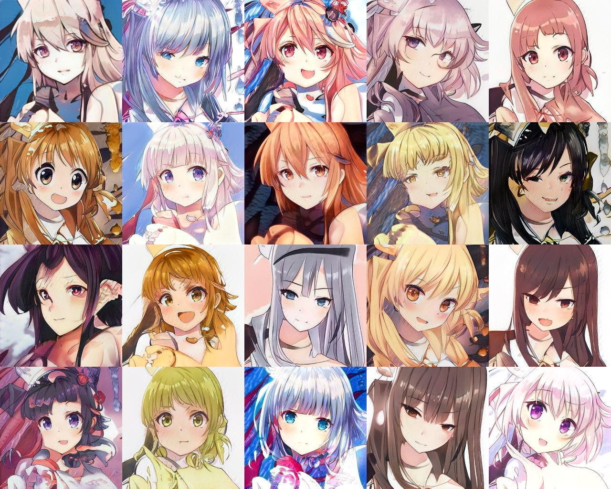
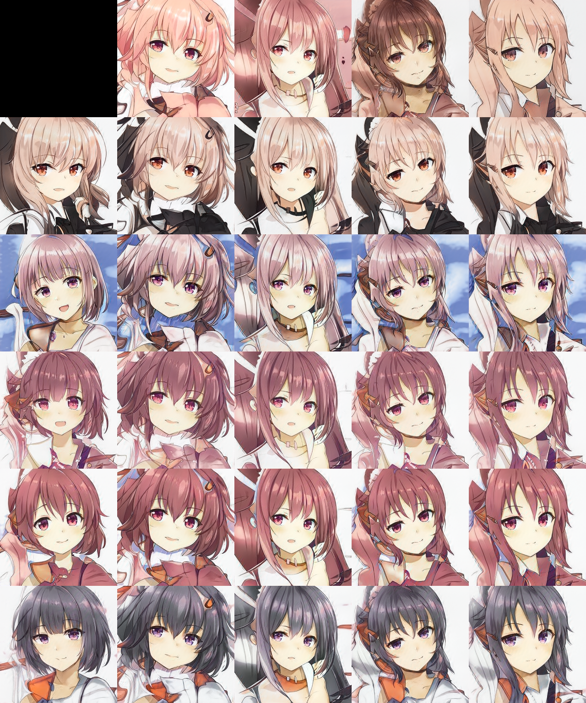
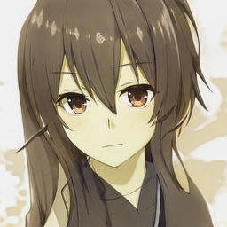
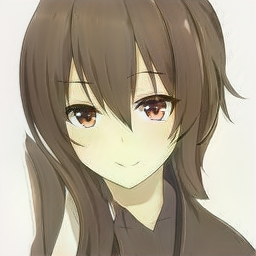
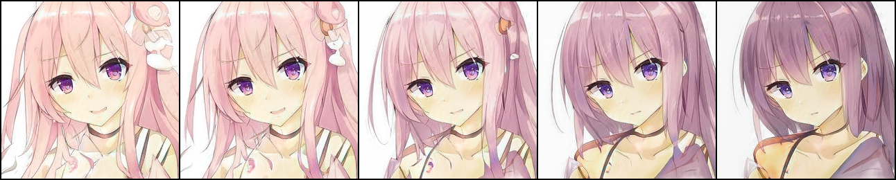

# Anime Face Genaration with StyleGAN2-ADA

Generate Anime Face with StyleGAN2-ADA




## Environments and Dependencies

- Python 3.8.16

Install requirements

``` bash
pip install -r requirements.txt -f https://download.pytorch.org/whl/torch_stable.html
```

## Data

Put raw images in `./data_raw/` and run

```
bash prepare_data.sh
```

## Train

If you want to train from scratch, modify hyperparameter in `train.sh` and run

```
bash train.sh
```

Or if you want to continue training from checkpoint, modify hyperparameter in `train_resume.sh`, especially `RESUME_NET` 

* **Set Initial Augmentation Strength**: use `--initstrength={float value}` to set the initialized strength of augmentations (really helpful when restarting training)
* **Set Initial Kimg count**: use `--nkimg={int value}` to set the initial kimg count (helpful with restarts)


```
bash train_resume.sh
```

For more training config, refer to [training](https://github.com/NVlabs/stylegan2-ada-pytorch#training-new-networks) in stylegan2-ada repo

- If you want to visualize training losses and scores, you can modify training-runs in `visualize.py` run 

```
python visualize.py
```

You can get a `results.csv` in `./csv_results/` folder. Visualize that data by your own

## Generate Image

You can download pretrained weights from [here](https://drive.google.com/file/d/1y12u6_3ORAr4Gn-F-jovtONU1deLBWOV/view?usp=share_link)

### Generate Single or Multiple Images

Modify hyperparameter in `generate.sh` and run

```
bash generate.sh
```

### Generate Style Mixing Images

Modify hyperparameter in `style_mixing.sh` and run

```
bash style_mixing.sh
```



### Project Image to Latent Space and Reconstruct

- Project Image to Latent Space

```
bash latent_projector.sh
```

- Generate Image from Latent Space

```
bash latent_generator.sh
```

| Root Image | Generate From Latent |
|---|---|
|  |  |

**Project Process**


You can find projecting process in better quality in video [here](https://drive.google.com/file/d/1YyMm_zPxt8eHxrHa-i7Ka0u9nXweER8d/view?usp=share_link)


## Closed Form Factorization

Thanks to [dvschultz/stylegan2-ada-pytorch](https://github.com/dvschultz/stylegan2-ada-pytorch) and [pbizimis/stylegan2-ada-pytorch](https://github.com/pbizimis/stylegan2-ada-pytorch)'s for convert Close Form Factorization from [rosinality/stylegan2-pytorch](https://github.com/rosinality/stylegan2-pytorch)'s repo

### Get factor

```
python closed_form_factorization.py --ckpt [PKL_CHECKPOINT]
```

You will get `factor.pt`

### Apply factor

```
python apply_factor.py -i 50 -d 5 --trunc 0.7 --seeds r1 --ckpt [PKL_CHECKPOINT] factor.pt
```

You will get image with your own factor modification



## References

- [NVlabs/stylegan2-ada-pytorch](https://github.com/NVlabs/stylegan2-ada-pytorch)
- [rosinality/stylegan2-pytorch](https://github.com/rosinality/stylegan2-pytorch)
- [dvschultz/stylegan2-ada-pytorch](https://github.com/dvschultz/stylegan2-ada-pytorch)
- [pbizimis/stylegan2-ada-pytorch](https://github.com/pbizimis/stylegan2-ada-pytorch)
